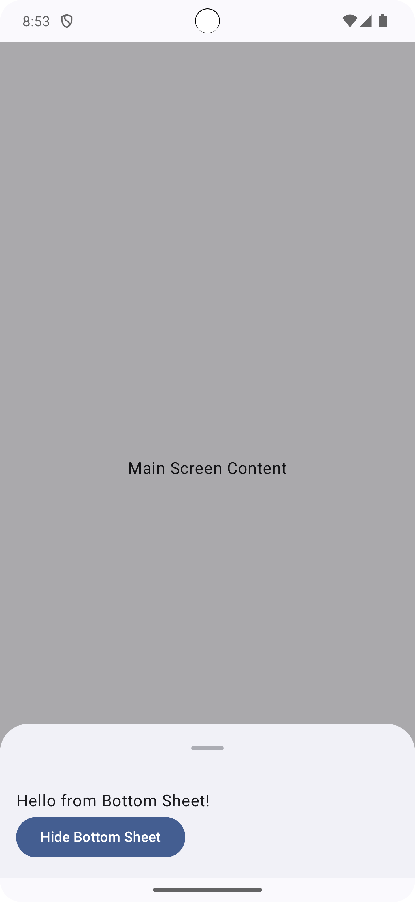

# Jetpack Compose with Material3 - Modal Bottom Sheet Example

This repository showcases how to implement **Modal Bottom Sheets** using **Material3** in a **Jetpack Compose** application. It demonstrates practical use cases, various customization options, and best practices for integrating bottom sheets effectively into a Compose-based UI.

## 📦 Project Highlights

- **Material3's `ModalBottomSheet`**: Implementation of bottom sheets using the latest Material3 guidelines.
- **Partial & Full Expansion**: Control over sheet state, allowing both partial and fully expanded views.
- **Composable Content**: Dynamic content that adapts based on interactions within the bottom sheet.
- **Sheet Dismissal & Control**: Demonstrates how to show, hide, and dismiss the bottom sheet programmatically.
- **Styling & Customization**: Showcases styling options, including shape, elevation, and background color adjustments.

## 📚 What's Inside

This repository includes:
1. **Basic Bottom Sheet Usage**: A simple example demonstrating how to create a modal bottom sheet and show or hide it with a button click.
2. **Partial Expansion Sheet**: A detailed guide on setting up a bottom sheet that partially expands, allowing for user-controlled expansion.
3. **Dynamic Sheet Content**: How to dynamically change the content of your bottom sheet based on user actions.
4. **Material3 Theme Integration**: Ensuring the bottom sheet components follow the app's theme and design language.

## 🚀 Getting Started

Clone the repository and open it in Android Studio. The project is structured with separate composable functions for different examples of bottom sheet usages, allowing easy exploration and customization.

## 📸 Screenshots

| Basic Sheet Example               | Partial Expansion Sheet | Rounded Corner Example                     | Custom Scrim Color Bottom Sheet                     |
|-----------------------------------|-------------------------|--------------------------------------------|-----------------------------------------------------|
|  |  |  |  |

## 🛠️ How to Use

1. **Setting Up**: Initialize the `ModalBottomSheetState` using `rememberModalBottomSheetState()`.
2. **Controlling the State**: Use a coroutine to show, hide, or partially expand the bottom sheet.
3. **Customizing the Look & Feel**: Modify the sheet's shape, background color, and scrim color as needed.

Check out the `ModalBottomSheet` examples in the project for hands-on learning!

## 📝 Article & More Info

For a detailed walkthrough and code explanations, visit the article:  
**[Implementing Material3 Modal Bottom Sheet in Jetpack Compose](https://gorkemkara.net/exploring-modalbottomsheetlayout-in-jetpack-compose-material3/)**

## 📖 Resources & Further Reading

- [Jetpack Compose Documentation](https://developer.android.com/jetpack/compose)
- [Material Design 3 Guidelines](https://m3.material.io/)
- [Advanced Navigation Techniques in Jetpack Compose](https://gorkemkara.net/advanced-navigation-techniques-in-jetpack-compose/)
- [State Management in Android Compose](https://gorkemkara.net/state-management-in-android-compose-mutablestate-remember/)

## 📝 License

This project is open-source and available under the MIT License. Feel free to use and modify it as per your needs.

---

Created with ❤️ by [Görkem KARA](gorkemkara.net).